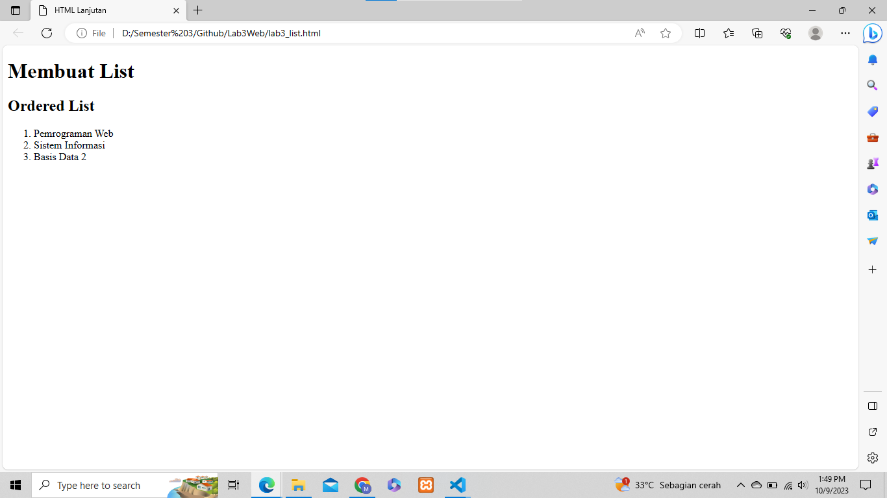
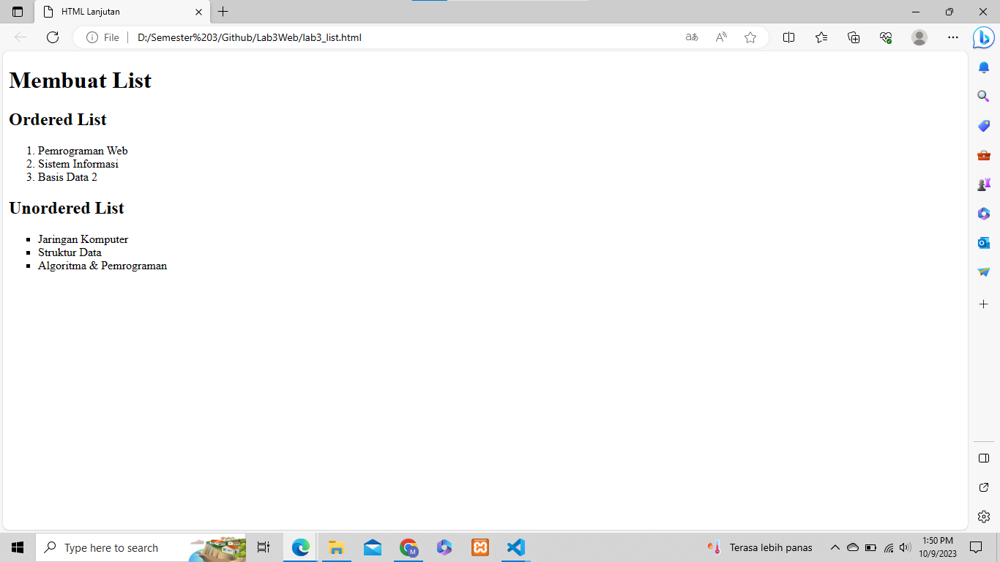
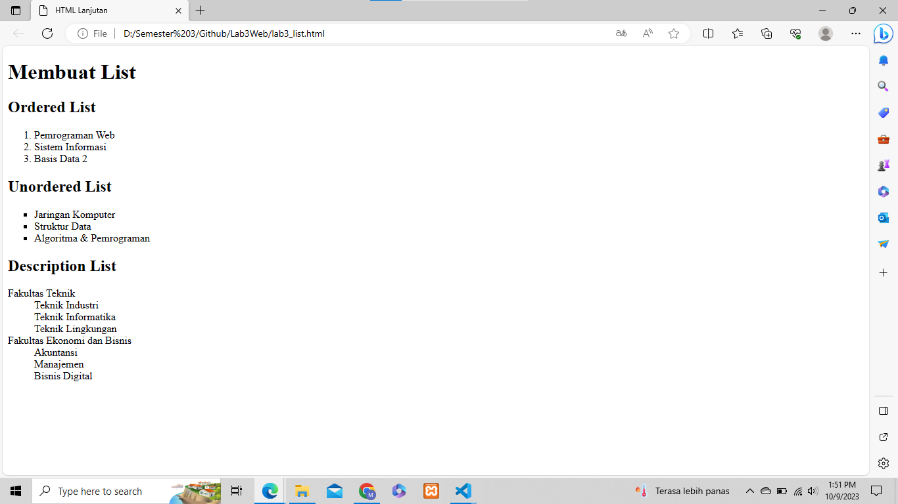
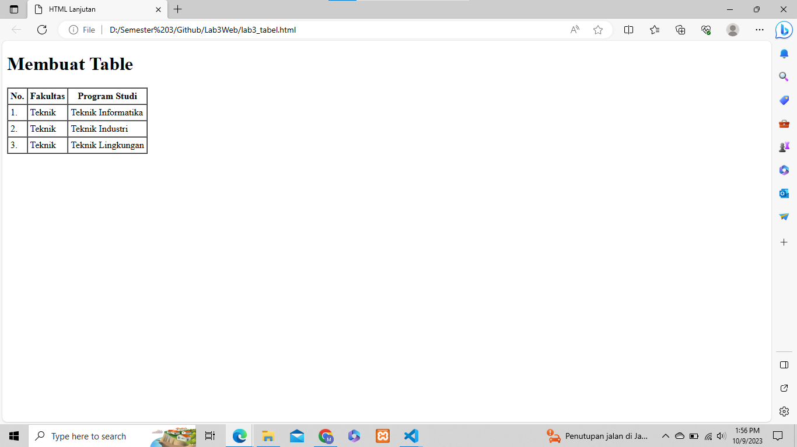
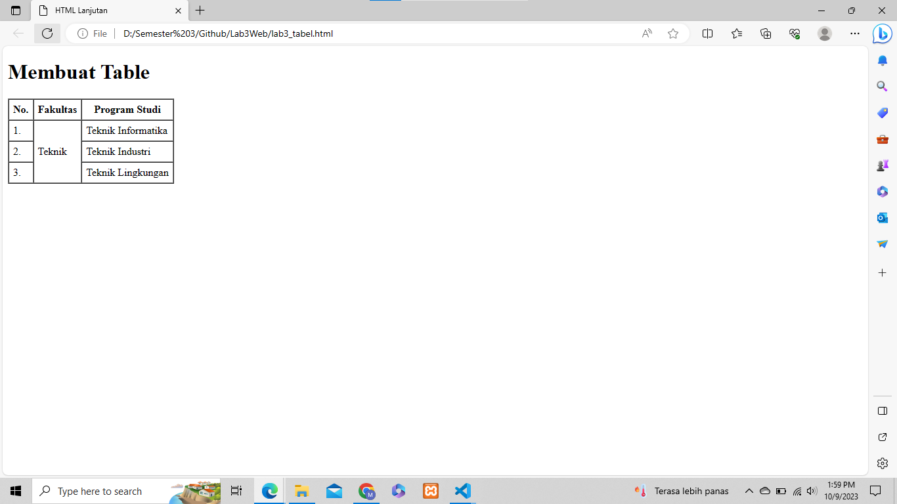
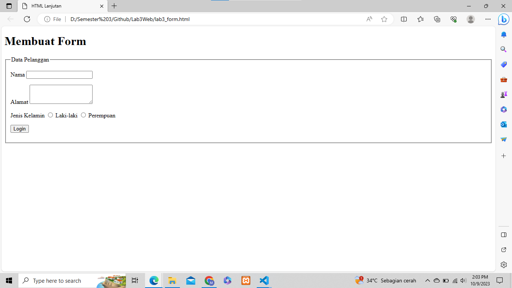
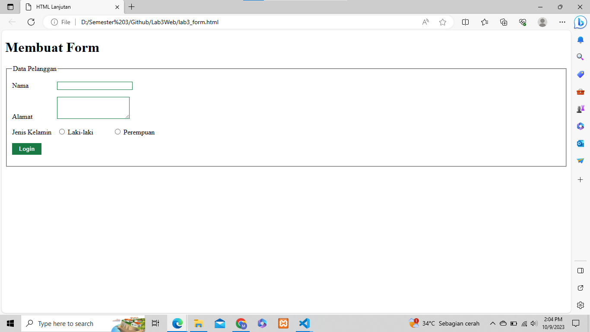
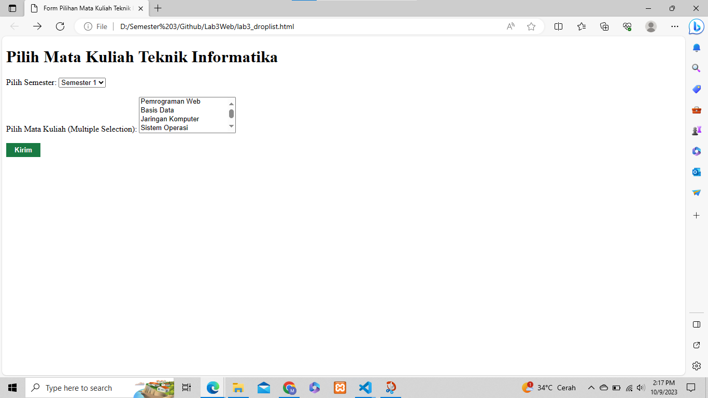

# Lab3Web

## LANGKAH-LANGKAH PRAKTIKUM

### LIST
1. Membuat dokumen HTML dan kemudian tambahkan kode untuk membuat Ordered List seperti berikut.<br>
    ```html
    <!DOCTYPE html>
    <html lang="en">
    <head>
        <meta charset="UTF-8">
        <meta name="viewport" content="width=device-width, initial-scale=1.0">
        <title>HTML Lanjutan</title>
    </head>
    <body>
    <header>
        <h1>Membuat List</h1>
    </header>
    <section id="order-list">
        <h2>Ordered List</h2>
        <ol>
            <li>Pemrograman Web</li>
            <li>Sistem Informasi</li>
            <li>Basis Data 2</li>
        </ol>
    </section>
    </body>
    </html>
    ```
    <br>

2. Kemudian tambakan kode untuk membuat Unordered List, setelah deklarasi ordered list pada 
section unordered-list, seperti berikut. <br>

    ```html
    <section id="unorder-list">
        <h2>Unordered List</h2>
        <ul type="square">
            <li>Jaringan Komputer</li>
            <li>Struktur Data</li>
            <li>Algoritma &amp; Pemrograman</li>
        </ul>
    </section>
    ```

    <br>

3. Kemudian tambahkan kode untuk membuat description list setelah deklarasi unorderd-list. <br>

    ```html
    <section id="unorder-list">
        <h2>Description List</h2>
        <dl>
            <dt>Fakultas Teknik</dt>
            <dd>Teknik Industri</dd>
            <dd>Teknik Informatika</dd>
            <dd>Teknik Lingkungan</dd>
            <dt>Fakultas Ekonomi dan Bisnis</dt>
            <dd>Akuntansi</dd>
            <dd>Manajemen</dd>
            <dd>Bisnis Digital</dd>
        </dl>
    </section>
    ```

    <br>

### TABEL

1. Membuat file baru HTML, kemudian selanjutnya tambahkan kode untuk membuat tabel sederhana seperti berikut:<br>

    ```html
    <table border="1" cellpadding="4" cellspacing="0">
        <thead>
            <tr>
                <th>No.</th>
                <th>Fakultas</th>
                <th>Program Studi</th>
            </tr>
        </thead>
        <tbody>
            <tr>
                <td>1.</td>
                <td>Teknik</td>
                <td>Teknik Informatika</td>
            </tr>
            <tr>
                <td>2.</td>
                <td>Teknik</td>
                <td>Teknik Industri</td>
            </tr>
            <tr>
                <td>3.</td>
                <td>Teknik</td>
                <td>Teknik Lingkungan</td>
            </tr>
        </tbody>
    </table>
    ```

    <br>

2. Untuk menggabungkan sel data, gunakan atribut rowspan dan colspan. Atribut rowspan untuk 
menggabungkan baris (secara vertikal) dan colspan untuk menggabungkan kolom (secara 
horizontal). <br>

    ```html
    <table border="1" cellpadding="6" cellspacing="0">
        <thead>
            <tr>
                <th>No.</th>
                <th>Fakultas</th>
                <th>Program Studi</th>
            </tr>
        </thead>
        <tbody>
            <tr>
                <td>1.</td>
                <td rowspan="3">Teknik</td>
                <td>Teknik Informatika</td>
            </tr>
            <tr>
                <td>2.</td>
                <td>Teknik Industri</td>
            </tr>
            <tr>
                <td>3.</td>
                <td>Teknik Lingkungan</td>
            </tr>
        </tbody>
    </table>
    ```
    
    <br>

### FORM

1. Membuat file baru HTML, kemudian selanjutnya tambahkan kode untuk membuat tabel sederhana seperti berikut: <br>

    ```html
    <form action="proses.php" method="post">
            <fieldset>
                <legend>Data Pelanggan</legend>
                <p>
                    <label for="nama">Nama</label>
                    <input type="text" id="nama" name="nama">
                </p>
                <p>
                    <label for="alamat">Alamat</label>
                    <textarea id="alamat" name="alamat" cols="20" rows="3"></textarea>
                </p>
                <p>
                    <label>Jenis Kelamin</label>
                    <input id="jk_l" type="radio" name="kelamin" value="L" />
                    <label for="jk_l">Laki-laki</label>
                    <input id="jk_p" type="radio" name="kelamin" value="P" />
                    <label for="jk_p">Perempuan</label>
                </p>
                <p>
                    <input type="submit" value="Login"></p>
            </fieldset>
    </form>
    ```

    <br>

2. Menambahkan Style pada Form,agar tampilan form lebih menarik, bisa ditambahkan CSS seperti berikut.<br>

    ```html
    <style>
            form p > label {
                display: inline-block;
                width: 100px;
            }
            form input[type="text"], form textarea {
                border: 1px solid #197a43;
            }
            form input[type="submit"] {
                border: 1px solid #197a43;
                background-color: #197a43;
                color: #ffffff;
                font-weight: bold;
                padding: 5px 15px;
            }
    </style>
    ```

    <br>

### PERTANYAAN & TUGAS

1. Buatlah form yang menampilkan dropdown menu dan listbox dengan multiple selection.<bt>

    ```html
    <!DOCTYPE html>
    <html>
    <head>
        <title>Form Pilihan Mata Kuliah Teknik Informatika</title>
        <style>
            form p > label {
                display: inline-block;
                width: 100px;
            }
            form input[type="text"], form textarea {
                border: 1px solid #197a43;
            }
            form input[type="submit"] {
                border: 1px solid #197a43;
                background-color: #197a43;
                color: #ffffff;
                font-weight: bold;
                padding: 5px 15px;
            }
        </style>
    </head>
    <body>
        <h1>Pilih Mata Kuliah Teknik Informatika</h1>
        <form action="proses_form.php" method="post">
            <label for="semester">Pilih Semester:</label>
            <select name="semester" id="semester">
                <option value="semester1">Semester 1</option>
                <option value="semester2">Semester 2</option>
                <option value="semester3">Semester 3</option>
                <option value="semester4">Semester 4</option>
                <option value="semester5">Semester 5</option>
                <option value="semester6">Semester 6</option>
                <option value="semester7">Semester 7</option>
                <option value="semester8">Semester 8</option>
            </select>

            <br><br>

            <label for="matakuliah">Pilih Mata Kuliah (Multiple Selection):</label>
            <select name="matakuliah[]" id="matakuliah" multiple="multiple">
                <option value="pemrogramanweb">Pemrograman Web</option>
                <option value="basisdata">Basis Data</option>
                <option value="jaringankomputer">Jaringan Komputer</option>
                <option value="sistemoperasi">Sistem Operasi</option>
                <option value="kecerdasanbuatan">Kecerdasan Buatan</option>
                <option value="grafikakomputer">Grafika Komputer</option>
                <option value="teoribahasapemrograman">Teori Bahasa Pemrograman</option>
            </select>

            <br><br>

            <input type="submit" value="Kirim">
        </form>
    </body>
    </html>
    ```

    <br>